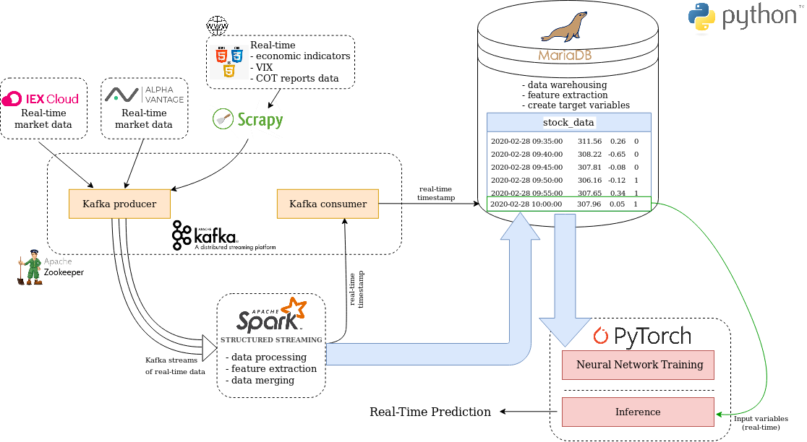

# Real-Time Financial Market Data Processing and Prediction

In this project, I developed a Real-Time Financial Market Data Processing and Prediction application that encompasses the following features:
- Extraction of financial market data from various sources using Scrapy Spiders and API calls
- Use of Apache Kafka to stream real-time data between internal components of an application
- Utilize of distributed Pyspark Structured Streaming program to ingest market data, perform feature extraction and merging of the data
- Use of MariaDB database for data warehousing and additional feature extraction
- Implementation of Pytorch bidirectional Gated Recurrent Unit neural network model
- Perform biGRU model training and evaluation
- Make a real-time prediction of future price movement of Stock Indexes, ETFs, Currencies or Commodities (whether the price will go up, down or stall)
- Use of various types of financial market data such for instance:
	- The SPDR S&P 500 order book (aggregated size of resting displayed orders at a price and side)
	- Economic indicators such as Nonfarm Payrolls, Unemployment Rate, Building Permits, Core Retail Sales and others
	- Commitment of Traders reports data
	- CBOE Volatility Index
	- Volume Imbalance, Delta Indictor, Bid-Ask Spread
	- Weighted average for bid's and ask's side orders
	- Bollinger Bands, Stochastic Oscillator, Average True Range
	- Open, high, low, close prices, volume and wick percentage
	- Volume, price and Delta indicator moving averages

Data provided by [IEX Cloud]( https://iexcloud.io)

## Architecture



## Table of Contents

* [API Market Data](./src/data_producer/getMarketData.py)
 	
    Performs call to IEX Cloud and Alpha Vantage API to retrieve specified financial data.

	IEX Cloud is the financial data platform that allows you to access fundamentals, ownership, international equities, mutual funds, options, real-time data, and alternative data from one fast and easy to use API.
	More information is available at: <https://iexcloud.io/docs/api/>.

	Alpha Vantage is the provider of free APIs for realtime and historical data on stocks, forex (FX), and digital/crypto currencies. More information is available at: <https://www.alphavantage.co/documentation/>


* [Econmic Indicators Spider](./src/data_producer/economic_indicators_spider.py)
 	
	Extracts economic indicators from Investing.com Economic Calendar. Customizable by specifying countries of interest, importance level and list of events to be considered. Allows to fetch economic indicators such as:

	- Core Retail Sales
	- Fed Interest Rate Decision
	- Core CPI
	- Crude Oil Inventories
	- Building Permits
	- Unemployment Rate
	- Nonfarm Payrolls
	- New Home Sales
	- and many others 

* [VIX Spider](./src/data_producer/vix_spider.py)
 	
	Extracts VIX data from cnbc.com. 
	
	VIX (CBOE Volatility Index) is a calculation designed to produce a measure of constant, 30-day expected volatility of the U.S. stock market, derived from real-time, mid-quote prices of S&P 500® Index (SPXSM) call and put options (<http://www.cboe.com/vix>)

* [COT Reports Spider](./src/data_producer/cot_reports_spider.py)
 	
	Extracts Commitment of Traders (COT) Reports data from tradingster.com. 

	The COT report is a weekly publication that shows the aggregate holdings of different participants in the U.S. futures market. Published every Friday by the Commodity Futures Trading Commission (CFTC) at 3:30 E.T., the COT report is a snapshot of the commitment of the classified trading groups as of Tuesday that same week (<https://www.investopedia.com/terms/c/cot.asp>).

	There are available COT reports that regard futures on Currencies (British Pound Sterling, Swiss Franc, Japanese Yen), Stock Indexes (S&P 500 STOCK INDEX, NASDAQ-100 STOCK INDEX (MINI)), Grains (Soybeans, Corn), Metals (Gold, Silver), Softs (Cocoa, Coffee, Sugar), Energies (Crude Oil, Natural Gas).
	
	In case of Currencies or Stock Indexes Spider extracts from specified COT report following data that pertains Asset Manager/Institutional and  Leveraged Funds traders:
   	     
    - Long and Short Positions
    - Long and Short Positions Change (with respect to previous data release)
    - Long and Short Open Interest

	Where Asset Managers includes mutual funds, endowments, and pension funds. The Leveraged includes CTAs, CPOs, and hedge funds.
    
	COT reports are most commonly used in long-term trading (weekly, daily time frames)

* [Config](./src/config.py)
 	
	The configuration file that includes: 
	- IEX and Alpha Vantage tokens
 	- Kafka brokers addresses and topics
 	- Scrapy user agent
 	- Database (MySQL/MariaDB) properties
 	- Financial data properties:
		- Number of order book price levels to include
		- Whether to use COT, VIX, volume data or Stochastic Oscillator
		- List of economic indicators to use
		- Specify period and number of standard deviations for Bollinger Bands
		- Specify Moving Averages periods

* [Data Producer](./src/data_producer/producer.py)
 	
   	The producer instantiates day session and gets the intraday market data from Alpha Vantage and IEX Cloud APIs, it also runs Scrapy Spiders to fetch economic indicators, COT Reports data and VIX. The collected data subsequently creates a set of streams that are published to corresponding Kafka topics.


* [Spark Data Consumer](./src/spark_consumer.py)

  	The distributed streaming Pyspark application that is responsible for following tasks:

    - Subscribe to a stream of records in given Kafka topic and create a streaming Data Frame based on the pre-defined schema
    - Fill missing values
    - Perform real-time financial data feature extraction:
        - Weighted average for bid's and ask's side orders      
        - Order Volume Imbalance
        - Micro-Price (according to Gatheral and Oomen)
        - Delta indicator
        - Bid-Ask Spread
        - Calculate the bid and ask price relative to best values
        - Day of the week
        - Week of the month
        - Start session (first 2 hours following market opening)
    - Perform oneHotEncoding
    - Join streaming data frames
    - Write stream to MySQL/MariaDB
    - Signal to Pytorch model readiness to make a prediction for current datapoint

	For testing we will run Spark locally with one worker thread (.master("local")).
	Other options to run Spark  (locally, on cluster) can be found here:
	<http://spark.apache.org/docs/latest/submitting-applications.html#master-urls>

	SPARK STRUCTURED STREAMING LIMITATIONS:

	In Spark Structured Streaming 2.4.4 several operations are not supported on Streaming DataFrames. The most significant constraint pertaining this application is that multiple streaming aggregations (a chain of aggregations on a streaming DataFrame) are not yet supported, thus the feature extraction process that requires multiple window aggregations will be moved from Spark to MariaDB.

	All unsupported operations are listed here <https://spark.apache.org/docs/latest/structured-streaming-programming-guide.html#unsupported-operations>


* [Database Initialization](./src/database/create_database.py)

	Creates a database to store Spark application data and perform further feature extraction. The following are the created additional features:

	- Volume Moving Averages
	- Price Moving Averages
	- Delta indicator Moving Averages
	- Bollinger Bands
	- Stochastic Oscillator
	- Average True Range

	Creates a VIEW with target variables, that are determined using following manner:

	|                Condition                    |  up1  |  up2  | down1 | down2 |
	| :------------------------------------------:|:-----:|:-----:|:-----:|:-----:|
	| 8th bar p8_close >= p0_close + (n1 * ATR)   |   1   |   0   |   0   |   0   |
	| 15th bar p15_close >= p0_close + (n2 * ATR) |   0   |   1   |   0   |   0   |
	| 8th bar p8_close <= p0_close - (n1 * ATR)   |   0   |   0   |   1   |   0   |
	| 15th bar p15_close <= p0_close - (n2 * ATR) |   0   |   0   |   0   |   1   |

* [BiGRU Model](./src/model/biGRU_model.py)

	Implementation of the bidirectional Gated Recurrent Unit neural network Pytorch model.

* [Model Training](./src/model/biGRU_model_training.ipynb)

	Jupyter notebook showing the process of creating and training the BiGRU model.

* [SQL Pytorch Dataloader](./src/database/sql_pytorch_dataloader.py)

	Implementation of the custom Pytorch Dataset that loads data from MySQL/MariaDB database using MySQLChunkLoader and MySQLBatchLoader. 

	Chunk loader calculates data chunk's normalization parameters which can subsequently be used by MySQLBatchLoader to normalize training batches (according to MIN and MAX of a chunk to which given batch belongs to). Also used to normalize validation and test sets during evaluation or real-time inference.

	The file also includes implementation of the TrainValTestSplit class that performs Train/Validation/Test splitting of a set of data chunks.

* [Predict](./predict.py)

	Reads the latest data point from MySQL/MariaDB database based on the current timestamp value that is sent from Spark application through Kafka, performs real-time data normalization and prediction using trained Pytroch model. 

## Installing

1. Download Apache Kafka using Homebrew
	- `brew install kafka`
2. Download Apache Spark from <https://spark.apache.org/downloads.html>
	- Go to the directory where spark zip file was downloaded and unpack it:
		- tar -zxvf spark-2.3.4-bin-hadoop2.7.tgz
	- Set $JAVA_HOME environmental variable in .bashrc file:
		- export JAVA_HOME='/usr/lib/jvm/java-1.8.0-openjdk-amd64'
	- In .bashrc file configure other environmental variables for Spark:
		- export SPARK_HOME='spark-2.3.4-bin-hadoop2.7'
		- export PATH=$SPARK_HOME:$PATH
		- export PATH=$PATH:$SPARK_HOME/bin
		- export PYTHONPATH=$SPARK_HOME/python;%SPARK_HOME%\python\lib\py4j-0.10.7-src.zip:%PYTHONPATH%
		- export PYSPARK_DRIVER_PYTHON="python" 
		- export PYSPARK_PYTHON=python3
		- export SPARK_YARN_USER_ENV=PYTHONHASHSE
3. Navigate to `/opt/homebrew/etc/kafka`. Create a config file for each of the brokers using sample properties:
	- `cp server.properties server-1.properties`
	- `cp server.properties server-2.properties`
4. Now edit these new files and set the following properties:
    ```
	config/server-1.properties:
	delete.topic.enable=true
        broker.id=1
        listeners=PLAINTEXT://:9093
        log.dirs=/tmp/kafka-logs-1
	```
	```
    config/server-2.properties:
	delete.topic.enable=true
        broker.id=2
        listeners=PLAINTEXT://:9094
        log.dirs=/tmp/kafka-logs-2
	```

## Usage

1. Start MySQL server:
	- service mysql start
2. Before each run of the application we have to start the ZooKeeper and Kafka brokers:
    - Start ZooKeeper:
		- `zkserver start`
    - Start Kafka nodes:
		```
		cd /opt/homebrew/opt/kafka
		bin/kafka-server-start.sh /opt/homebrew/etc/kafka/server.properties
		bin/kafka-server-start.sh /opt/homebrew/etc/kafka/server-1.properties
		bin/kafka-server-start.sh /opt/homebrew/etc/kafka/server-2.properties
		```
 3. Create Kafka topics if run the application for the first time (list of sample topics can be found in config.py file):
 	- Create topic:
		- `bin/kafka-topics.sh --create --bootstrap-server localhost:9092 --replication-factor 3 --partitions 1 --topic topic_name`
	- List available topics:
		- `bin/kafka-topics.sh --list --bootstrap-server localhost:9092`  
 4. Specify your configuration by modifying config.py file:
 	- Add your IEX and Alpha Vantage tokens
 	- Specify Kafka brokers addresses and topics
 	- Specify Scrapy user agent
 	- Add database (MySQL/MariaDB) properties
 	- Specify other properties regarding financial data
 5. Create a MariaDB database by running create_database.py file (it is necessary only with the first use of the application)   
 6. Run spark_consumer (it have to be launched before data producer).
 7. Then we can run producer.py to fetch financial data and send it through Kafka to Pyspark.
 8. To make a real-time prediction run predict.py file (only data that comes after predict.py is launched is going to be considered)
